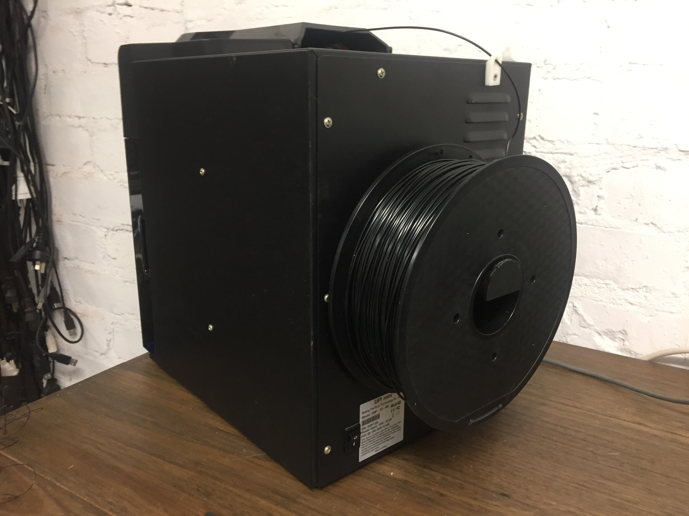

# UP-grade
A customisable roll holder for the [UP mini 3D printer](https://www.up3d.com/?r=mini), so this small printer can carry big filament rolls.

Parametric model written for [OpenScad](http://www.openscad.org) by Bruno Herfst 2016.

